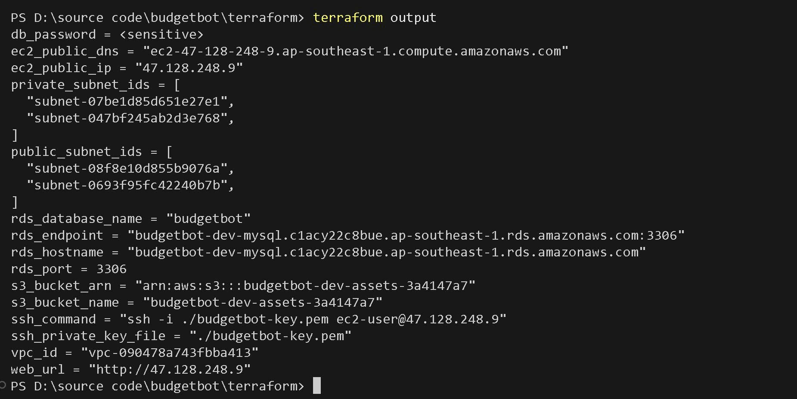
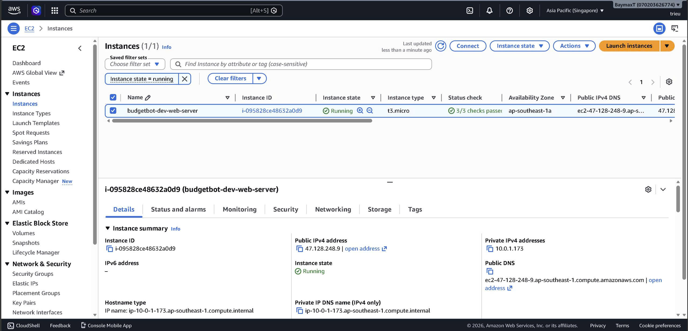
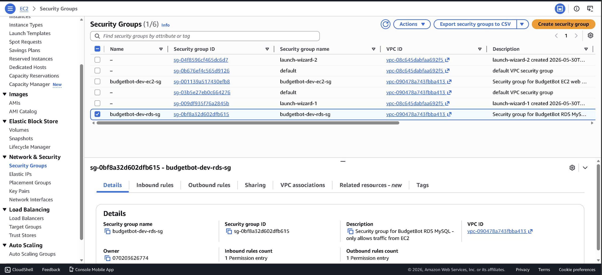
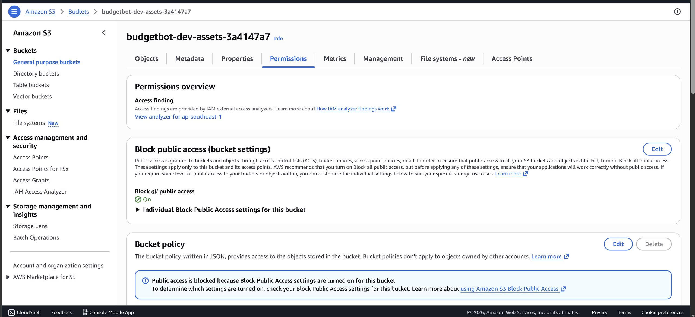
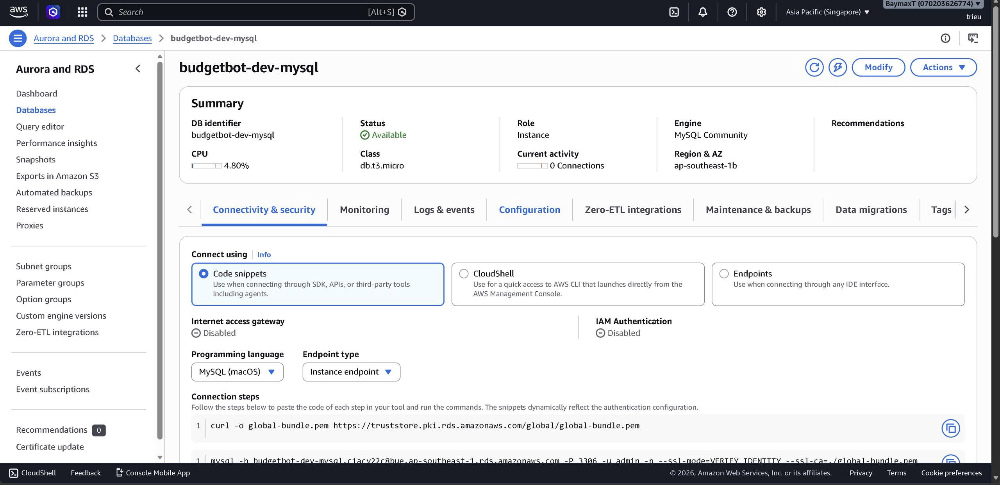
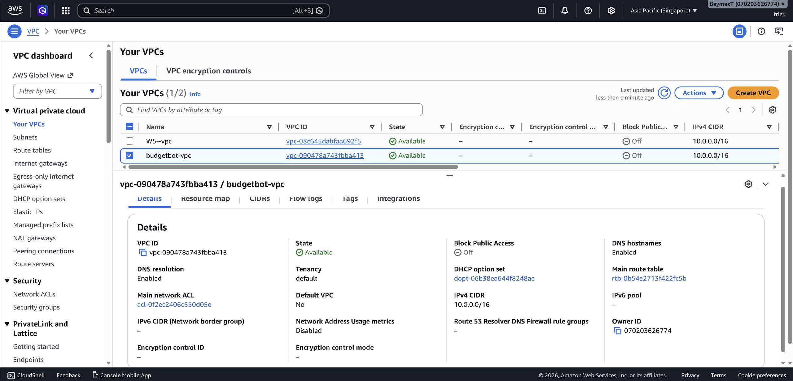
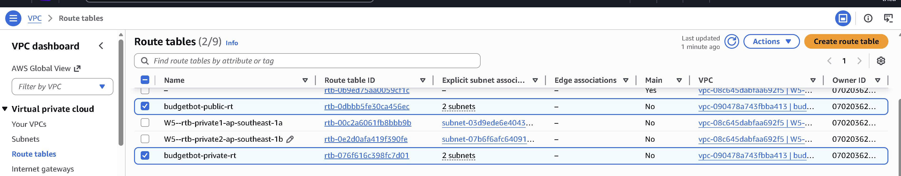

# BudgetBot — W7 Capstone Starter

**Domain:** FinTech. Upload bank statement CSV → AI categorizes each transaction → spending summary by category.

Runs **fully locally** with rule-based categorization stub. Flip env vars to use Bedrock Haiku in production.

---

## Architecture

```
                          ┌──────────────────────────────────────────────┐
                          │              AWS Cloud (ap-southeast-1)      │
                          │                                              │
   Internet Users ──────► │  ┌─── VPC 10.0.0.0/16 ──────────────────┐   │
                          │  │                                       │   │
                          │  │  ┌─ Public Subnets ──────────────┐    │   │
                          │  │  │  10.0.1.0/24  (AZ 1a)         │    │   │
                          │  │  │  10.0.2.0/24  (AZ 1b)         │    │   │
                          │  │  │                                │    │   │
                          │  │  │  ┌──────────────────────┐      │    │   │
                          │  │  │  │  EC2 (t3.micro)      │      │    │   │
                          │  │  │  │  Web Server :80      │──────┼────┼──►│ S3 Bucket
                          │  │  │  └──────────┬───────────┘      │    │   │ (Static Assets)
                          │  │  └─────────────┼──────────────────┘    │   │
                          │  │                │ MySQL :3306            │   │
                          │  │  ┌─ Private Subnets ─────────────┐     │   │
                          │  │  │  10.0.101.0/24  (AZ 1a)       │     │   │
                          │  │  │  10.0.102.0/24  (AZ 1b)       │     │   │
                          │  │  │                                │     │   │
                          │  │  │  ┌──────────────────────┐      │     │   │
                          │  │  │  │  RDS MySQL 8.0       │      │     │   │
                          │  │  │  │  db.t3.micro         │      │     │   │
                          │  │  │  └──────────────────────┘      │     │   │
                          │  │  └────────────────────────────────┘     │   │
                          │  └────────────────────────────────────────┘   │
                          └──────────────────────────────────────────────┘
```

---

## Project Structure

```
budgetbot/
├── src/                        # Application source code
│   ├── app.py                  # FastAPI app + routes
│   ├── config.py               # Env-driven settings
│   ├── handlers.py             # CSV parsing + categorization + aggregation
│   └── adapters/
│       ├── ai.py               # BedrockAI | LocalAI (rule-based)
│       ├── storage.py          # S3Storage | LocalStorage
│       ├── userstore.py        # DynamoDB | Postgres | SQLite | MySQL adapters
│       └── factory.py          # Adapter factory based on env
├── frontend/
│   └── index.html              # Single-page app (vanilla JS)
├── terraform/                  # Infrastructure as Code (AWS)
│   ├── provider.tf             # AWS, TLS, Local, Random providers
│   ├── backend.tf              # S3 backend + DynamoDB locking (commented)
│   ├── main.tf                 # VPC module call + AMI lookup + random resources
│   ├── variables.tf            # Input variables (all have defaults)
│   ├── terraform.tfvars        # Variable overrides (gitignored)
│   ├── ec2.tf                  # EC2 instance + TLS key pair + IAM role
│   ├── rds.tf                  # RDS MySQL 8.0 in private subnet
│   ├── s3.tf                   # S3 bucket + versioning + encryption
│   ├── security_groups.tf      # EC2 SG (HTTP/SSH) + RDS SG (MySQL from EC2 only)
│   ├── outputs.tf              # All output values
│   ├── user_data.sh            # EC2 bootstrap script
│   └── modules/
│       └── vpc/                # Reusable VPC module
│           ├── main.tf         # VPC, IGW, subnets, route tables
│           ├── variables.tf    # Module input variables
│           └── outputs.tf      # Module outputs
├── evidence/                   # AWS deployment evidence screenshots
├── sample_data/                # Sample CSV files
├── tests/                      # Smoke tests
└── _data/                      # Local runtime data (gitignored)
```

---

## Run Locally (2 minutes)

```bash
python3 -m venv .venv
source .venv/bin/activate
pip install -r requirements.txt

cp .env.example .env
uvicorn src.app:app --reload --port 8000

# In another terminal:
curl http://localhost:8000/health
open http://localhost:8000

# End-to-end smoke:
curl -X POST http://localhost:8000/upload \
  -H "X-User-Id: alice" \
  -F "file=@sample_data/sample_statement.csv"

curl "http://localhost:8000/summary?month=2026-05" \
  -H "X-User-Id: alice"
```

Run tests:
```bash
pytest -v
```

---

## Terraform — Deploy Infrastructure on AWS

### Prerequisites

- [Terraform](https://developer.hashicorp.com/terraform/install) >= 1.0
- AWS CLI configured with valid credentials (`aws configure`)
- AWS account with permissions for VPC, EC2, RDS, S3, IAM

### Deploy (1 command)

```bash
cd terraform/

# Initialize providers & modules
terraform init

# Validate configuration
terraform validate

# Preview changes
terraform plan

# Deploy everything
terraform apply -auto-approve
```

### What gets created

| # | Resource | Details |
|---|----------|---------|
| 1 | **VPC** | `10.0.0.0/16` with DNS hostnames enabled |
| 2 | **Internet Gateway** | Attached to VPC |
| 3-4 | **Public Subnets × 2** | `10.0.1.0/24` (AZ 1a) + `10.0.2.0/24` (AZ 1b) |
| 5-6 | **Private Subnets × 2** | `10.0.101.0/24` (AZ 1a) + `10.0.102.0/24` (AZ 1b) |
| 7-8 | **Route Tables × 2** | Public → IGW, Private → local only |
| 9 | **EC2 Instance** | t3.micro, Amazon Linux 2023, public subnet, auto-generated TLS key pair |
| 10 | **RDS MySQL 8.0** | db.t3.micro, private subnet, auto-generated password |
| 11 | **S3 Bucket** | Versioning + AES-256 encryption + public access blocked |
| 12 | **EC2 Security Group** | Inbound: HTTP (80), SSH (22) |
| 13 | **RDS Security Group** | Inbound: MySQL (3306) from EC2 SG only |
| 14 | **IAM Role** | EC2 → S3 access (GetObject, PutObject, ListBucket) |

### View outputs after deploy

```bash
terraform output              # Show all outputs
terraform output web_url      # Web app URL
terraform output ssh_command  # SSH command
terraform output rds_endpoint # RDS endpoint
terraform output -raw db_password  # Auto-generated DB password
```

### Tear down

```bash
terraform destroy -auto-approve
```

### Enable S3 Backend (optional)

To store Terraform state remotely with locking, see instructions in `terraform/backend.tf`.

---

## Security Groups

| Security Group | Inbound Rules | Outbound |
|---|---|---|
| **EC2 SG** | Port 80 (HTTP) from `0.0.0.0/0` · Port 22 (SSH) from `var.my_ip` | All |
| **RDS SG** | Port 3306 (MySQL) from **EC2 SG only** | All |

---

## Evidence — AWS Deployment Screenshots

| # | Screenshot | Description |
|---|------------|-------------|
| 1 |  | `terraform output` — all deployed resource details |
| 2 |  | EC2 instance running (t3.micro, ap-southeast-1a) |
| 3 |  | EC2 SG + RDS SG configuration |
| 4 |  | S3 bucket — Block all public access: ON |
| 5 |  | RDS MySQL 8.0 — Available, db.t3.micro |
| 6 |  | VPC — CIDR 10.0.0.0/16, DNS enabled |
| 7 |  | Public + Private route tables |

---

## Deploy Hints

Env flip for production:
```diff
- AI_BACKEND=local
+ AI_BACKEND=bedrock
+ AI_MODEL_ID=anthropic.claude-3-5-haiku-20241022-v1:0

- STORAGE_BACKEND=local
+ STORAGE_BACKEND=s3
+ STORAGE_BUCKET=budgetbot-statements-g<N>-<accountid>

- USERSTORE_BACKEND=sqlite
+ USERSTORE_BACKEND=mysql
+ MYSQL_HOST=<rds-endpoint>
+ MYSQL_PORT=3306
+ MYSQL_DB=budgetbot
+ MYSQL_USER=admin
+ MYSQL_PASSWORD=<auto-generated>
```

---

## Sample CSV Format

```
date,description,amount
2026-05-02,Highlands Coffee - Bui Vien,-65000
2026-05-04,Salary deposit credit,18500000
```

Header row optional. Negative amounts = expenses; positive = income. Currency assumed VND in the local stub but Bedrock doesn't care — describe the transaction and the LLM figures it out.


---

## Run locally (2 minutes)

```bash
python3 -m venv .venv
source .venv/bin/activate
pip install -r requirements.txt

cp .env.example .env
uvicorn src.app:app --reload --port 8000

# In another terminal:
curl http://localhost:8000/health
open http://localhost:8000

# End-to-end smoke:
curl -X POST http://localhost:8000/upload \
  -H "X-User-Id: alice" \
  -F "file=@sample_data/sample_statement.csv"

curl "http://localhost:8000/summary?month=2026-05" \
  -H "X-User-Id: alice"
```

Run tests:
```bash
pytest -v
```

---

## What's in the code

```
src/
├── app.py               FastAPI app + routes. Runs on Lambda, ECS, EC2, App Runner.
├── config.py            Env-driven settings.
├── handlers.py          CSV parsing + categorization orchestration + aggregation.
└── adapters/
    ├── ai.py            BedrockAI (real InvokeModel Converse) | LocalAI (rule-based)
    ├── storage.py       S3Storage | LocalStorage (filesystem)
    ├── userstore.py     DynamoDBUserStore | PostgresUserStore | SQLiteUserStore
    └── factory.py       Picks adapter based on env
```

**No vector store** — BudgetBot uses direct InvokeModel for one-shot classification. This is a key architecture difference from StudyBot and DocHub (which use RAG).

---

## 9 deployment decisions still yours

Same matrix as the other apps. Notable points for BudgetBot:

- **DB choice trade-off:** Aggregations like `SELECT category, SUM(amount) FROM transactions WHERE user_id=? GROUP BY category` are natural fits for SQL (Postgres). DynamoDB requires a Scan or careful GSI design. Document this trade-off in your Evidence Pack.
- **RDS Proxy:** With Lambda + Postgres, you'll want RDS Proxy to handle connection pooling. The code uses `psycopg2.connect()` — Lambda containers each open their own connection.
- **Cost:** RDS db.t3.micro (~$1.25/48h in Singapore) is the biggest fixed cost. Single-AZ. Skip Multi-AZ for hackathon.

---

## Deploy hints

Env flip:
```diff
- AI_BACKEND=local
+ AI_BACKEND=bedrock
+ AI_MODEL_ID=anthropic.claude-3-5-haiku-20241022-v1:0

- STORAGE_BACKEND=local
+ STORAGE_BACKEND=s3
+ STORAGE_BUCKET=budgetbot-statements-g<N>-<accountid>

- USERSTORE_BACKEND=sqlite
+ USERSTORE_BACKEND=postgres          # OR dynamodb
+ USERSTORE_POSTGRES_URL=postgresql://user:pw@your-rds-endpoint:5432/budgetbot
```

For DynamoDB, set `USERSTORE_TABLE=...` instead of the postgres URL.

Lambda packaging: wrap `from src.app import app` with `Mangum` (`pip install mangum`).

---

## Customization ideas (Criterion I)

- **Budget goals + alerts** — let users set "max $200/month on Food" with SNS notification when crossed
- **Recurring transaction detection** — flag subscriptions automatically (Netflix, Spotify, etc.)
- **Multi-currency** — detect VND vs USD, convert on the fly
- **Forecasting** — given 2 months of data, predict next month per category
- **Anomaly detection** — flag transactions >2σ from category mean (real-time use case for AWS Lookout for Metrics OR a simple Lambda)
- **Receipt OCR** — accept PDF receipts, extract via Textract → categorize

---

## Sample CSV format

```
date,description,amount
2026-05-02,Highlands Coffee - Bui Vien,-65000
2026-05-04,Salary deposit credit,18500000
```

Header row optional. Negative amounts = expenses; positive = income. Currency assumed VND in the local stub but Bedrock doesn't care — describe the transaction and the LLM figures it out.
